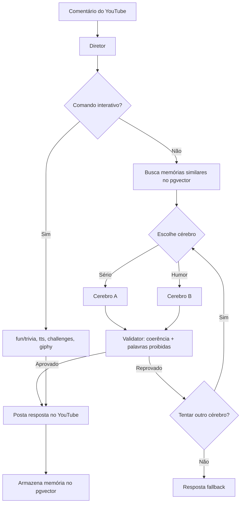
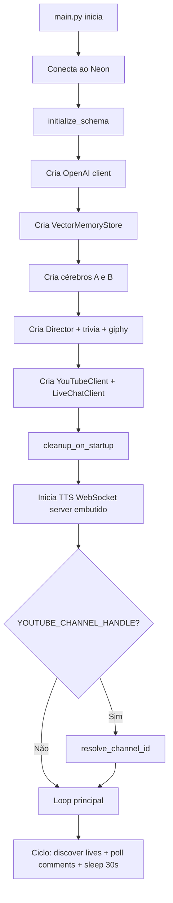

# YouTube Two-Brain Bot

Bot em Python para comentários do YouTube com dois cérebros (sério e humorístico), Diretor com validação e loop de reparo, memória vetorial no Neon/pgvector, comandos interativos, TTS (Text-to-Speech), e limpeza automática de dados antigos.

---

## Estrutura do Projeto

```
.
├── docker-compose.yml
├── Dockerfile
├── README.md
├── requirements.txt
├── .gitignore
├── data/
│   ├── trivia_questions.json          # Perguntas do quiz
│   └── tts_audio/                     # Áudios TTS gerados (gitignored)
├── migrations/
│   └── 001_init.sql                   # Schema SQL para deploy manual
├── tools/
│   ├── fix_tts_constraint.py
│   ├── get_youtube_refresh_token.py   # Gera refresh token OAuth do YouTube
│   └── test_catbox_upload.py
├── tts-backend/                       # ⚠️ Deprecado — remova em deploy
└── youtube_bot/
    ├── __init__.py
    ├── config.py                      # Settings via .env
    ├── main.py                        # Entry point do bot
    ├── tts_ws_server.py               # WebSocket server embutido para TTS
    ├── brains/
    │   ├── base.py                    # Interface abstrata Brain
    │   ├── cerebro_a.py               # Cérebro sério/analítico
    │   ├── cerebro_b.py               # Cérebro humorístico
    │   └── diretor.py                 # Orquestrador: escolhe cérebro, valida, responde
    ├── db/
    │   ├── pool.py                    # Pool de conexões asyncpg (Neon)
    │   └── models.py                  # Schema + funções CRUD
    ├── fun/
    │   ├── challenges.py              # Comandos: espelho, rima, emoji
    │   ├── giphy.py                   # Cliente da API Giphy
    │   ├── trivia.py                  # Jogo de quiz (!quiz / !resposta)
    │   └── tts.py                     # Comando !tts (Text-to-Speech)
    ├── memory/
    │   ├── consolidator.py            # Consolida memórias episódicas em fatos
    │   ├── vector_store.py            # Embeddings + busca vetorial (pgvector)
    │   └── cleanup.py                 # Limpeza de dados antigos na inicialização
    ├── utils/
    │   ├── helpers.py                 # Funções utilitárias
    │   └── logger.py                  # Configuração de logging
    ├── validation/
    │   ├── metrics.py                 # Análise de sentimento
    │   └── validator.py               # Validação + loop de reparo de respostas
    └── youtube/
        ├── client.py                  # Cliente da YouTube Data API v3
        └── live.py                    # Conexão com chat ao vivo
```

---

## Configuração

### 1. Criar ambiente virtual

```powershell
python -m venv .venv
.\.venv\Scripts\Activate.ps1
pip install -r requirements.txt
```

### 2. Criar arquivo `.env`

```powershell
Copy-Item .env.example .env
```

### 3. Variáveis de ambiente

```env
# ── OpenAI / LLM ──────────────────────────────────
OPENAI_API_KEY=sk-...
OPENAI_BASE_URL=https://api.fireworks.ai/inference/v1
OPENAI_CHAT_MODEL=accounts/fireworks/models/deepseek-v3p1
OPENAI_EMBEDDING_MODEL=fireworks/qwen3-embedding-8b
OPENAI_EMBEDDING_DIMENSIONS=1536

# ── Banco de dados (Neon PostgreSQL) ──────────────
NEON_DATABASE_URL=postgresql://...

# ── YouTube ───────────────────────────────────────
YOUTUBE_CLIENT_ID=...
YOUTUBE_CLIENT_SECRET=...
YOUTUBE_REFRESH_TOKEN=...
YOUTUBE_API_KEY=...
YOUTUBE_CHANNEL_HANDLE=@SlendermanGames   # @handle do canal a monitorar (detecta lives automaticamente)
YOUTUBE_VIDEO_IDS=video_id_1,video_id_2   # Opcional: IDs fixos de videos (comentarios)
YOUTUBE_BOT_CHANNEL_ID=...                 # ID do canal do bot (evita auto-resposta)
YOUTUBE_LIVE_URL=                          # Opcional: URL/ID de uma live especifica (evita search.list)

# ── Giphy ─────────────────────────────────────────
GIPHY_API_KEY=...

# ── TTS (Text-to-Speech) ──────────────────────────
TTS_PROVIDER=gtts                   # "gtts" (gratuito) ou "openai"
TTS_VOICE=pt                        # gTTS: pt, pt-br, en, es | OpenAI: nova, alloy, echo...
TTS_OUTPUT_DIR=data/tts_audio       # Diretório de saída dos .mp3
TTS_COOLDOWN_MINUTES=10             # Intervalo mínimo entre TTS por usuário
TTS_WS_PORT=8765                    # Porta do WebSocket embutido (0.0.0.0:8765/ws)

# ── Limpeza de dados ──────────────────────────────
MEMORY_RETENTION_DAYS=14            # Dias para reter dados (padrão: 2 semanas)

# ── Comportamento ─────────────────────────────────
DRY_RUN=true                        # true = loga sem postar | false = posta de verdade
POLL_INTERVAL_SECONDS=30            # Intervalo entre polls de comentários
MAX_REPAIR_ATTEMPTS=3               # Tentativas de reparo de resposta
COHERENCE_THRESHOLD=0.60            # Nota mínima de coerência
BRAIN_SURPRISE_CHANCE=0.20          # Chance de trocar de cérebro aleatoriamente
FORBIDDEN_WORDS=palavra1,palavra2   # Palavras bloqueadas (separadas por vírgula)
LOG_LEVEL=INFO
```

> **Nota:** `YOUTUBE_API_KEY` permite **ler** comentários. Para **postar** respostas, você precisa do OAuth completo (`CLIENT_ID` + `CLIENT_SECRET` + `REFRESH_TOKEN`).

---

## Gerar Refresh Token do YouTube

```powershell
python tools/get_youtube_refresh_token.py
```

O navegador abrirá para você autorizar o canal. Copie o `YOUTUBE_REFRESH_TOKEN=...` exibido para o seu `.env`.

---

## Banco de Dados (Neon + pgvector)

O schema é inicializado automaticamente na subida do bot via `initialize_schema()`. Para deploy manual:

```sql
\i migrations/001_init.sql
```

O Neon precisa ter a extensão `vector` habilitada.

### Tabelas

| Tabela | Descrição |
|---|---|
| `usuarios` | Dados dos usuários do YouTube (pontos, estatísticas por cérebro) |
| `mensagens` | Histórico de mensagens recebidas (`comment` ou `live`) |
| `respostas_geradas` | Respostas produzidas pelos cérebros, com status de aprovação |
| `memorias_semanticas` | Embeddings vetoriais (pgvector) para busca semântica de contexto |
| `configuracoes_cerebro` | Prompts base e pesos de cada cérebro (A e B) |
| `tts_solicitacoes` | Solicitações de Text-to-Speech com status e URL do áudio (Catbox) |
| `historico_humor` | Registro de humor dos usuários ao longo do tempo |

---

## Rodar

```powershell
python -m youtube_bot.main
```

Para postar respostas reais no YouTube:

```env
DRY_RUN=false
```

> ⚠️ Teste antes com `DRY_RUN=true` para validar o comportamento.

---

## TTS WebSocket Server (embutido)

O bot agora inclui um **servidor WebSocket embutido** (via `aiohttp`) que roda na mesma porta que o bot e pode ser acessado publicamente (ex: via Railway HTTPS proxy).  
Endereço: `ws://SEU_HOST:8765/ws`

**O que ele faz:**
- Escuta na interface `0.0.0.0` (porta configurável via `TTS_WS_PORT`)
- Oferece um endpoint WebSocket em `/ws`
- Oferece um health check em `/health`
- A cada 2 segundos, consulta o banco por TTS recém-concluídos
- Envia o **link do Catbox** (MP3) para todos os clientes conectados
- Marca o TTS como `reproduzido` no banco

**Payload enviado para o cliente:**
```json
{
  "id": 123,
  "username": "nome_do_usuario",
  "message": "texto que foi falado",
  "type": "url",
  "audio": "https://files.catbox.moe/abc123.mp3"
}
```

**Cliente de exemplo (JavaScript):**
```js
const ws = new WebSocket('wss://seudominio.com/ws');
ws.onmessage = (e) => {
  const d = JSON.parse(e.data);
  if (d.type === "url") {
    const audio = new Audio(d.audio);
    audio.play();
  }
};
```

> **Nota:** O antigo servidor Bun (`tts-backend/`) foi substituído e não é mais necessário.   
> Mantenha-o apenas como referência.

---

## Modos de Operação

O bot suporta dois modos, que podem ser usados simultaneamente:

### 1. Modo Canal (Live Detection)

Configure `YOUTUBE_CHANNEL_HANDLE=@SlendermanGames` e o bot irá:

- Resolver o `@handle` para o `channel_id` na inicialização
- A cada ciclo de polling, buscar **lives ativas** no canal via `search.list(eventType=live)`
- Conectar automaticamente ao chat ao vivo de cada nova live detectada
- Responder mensagens do chat em tempo real
- Desconectar quando a live terminar (após 5 erros consecutivos)

```
Bot inicia → resolve @SlendermanGames → channel_id
    │
    ▼
Loop: search.list(eventType=live) a cada 30s
    │
    ├── Nova live detectada? → conecta ao liveChat
    │   └── poll_live_chat (background task)
    │       └── responde mensagens do chat ao vivo
    │
    └── Live já conhecida? → ignora
```

### 2. Modo Vídeos Fixos (Comentários)

Configure `YOUTUBE_VIDEO_IDS=id1,id2` para monitorar comentários em vídeos específicos (não-live).

> **Dica:** Você pode usar **ambos os modos ao mesmo tempo** — o bot monitora lives do canal E comentários de vídeos fixos.

---

## Comandos Interativos

Os usuários podem interagir com o bot digitando nos comentários:

| Comando | Descrição |
|---|---|
| `!quiz` | Inicia uma pergunta de quiz relâmpago |
| `!resposta <texto>` | Responde ao quiz ativo |
| `espelho <frase>` | Devolve a frase com palavras invertidas |
| `rima <palavra>` | Cria uma rima improvisada |
| `gif` | Busca um GIF aleatório (requer `GIPHY_API_KEY`) |
| `!tts <texto>` | Converte o texto em áudio .mp3 (Text-to-Speech) |

---

## Comando `!tts` — Text-to-Speech

### Fluxo

```
Usuário: !tts Olá, seja bem-vindo ao canal!
    │
    ▼
Extrai e sanitiza o texto (máx. 300 caracteres)
    │
    ▼
Verifica rate limit no banco (1 TTS a cada 10 min por usuário)
    │
    ▼
Insere na tabela tts_solicitacoes (status=pendente → processando)
    │
    ▼
Gera áudio .mp3 via gTTS (Google) ou OpenAI TTS
    │
    ▼
Salva em data/tts_audio/tts_<hash>.mp3 (com cache)
    │
    ▼
Faz upload do MP3 para o Catbox.moe
    │
    ▼
Atualiza status=concluido com a URL publica do Catbox
    │
    ▼
Bot responde: "Audio TTS gerado: https://files.catbox.moe/abc123.mp3"
```

### Provedores

| Provedor | Configuração | Custo |
|---|---|---|
| **gTTS** (padrão) | `TTS_PROVIDER=gtts` | Gratuito |
| **OpenAI TTS** | `TTS_PROVIDER=openai` | Pago (API) |

### Rate Limit

Cada usuário só pode usar `!tts` uma vez a cada `TTS_COOLDOWN_MINUTES` (padrão: 10 minutos). A verificação é feita diretamente no banco de dados (Neon), funcionando mesmo com múltiplas instâncias do bot.

Se o usuário tentar antes do tempo:

> *"Aguarde 3m 45s para usar !tts novamente. (Limite: 1 a cada 10 min)"*

---

## Limpeza Automática de Dados

Na inicialização do bot, uma limpeza **única** é executada para remover registros antigos:

| Tabela | O que é removido |
|---|---|
| `mensagens` | Todas com mais de `MEMORY_RETENTION_DAYS` |
| `respostas_geradas` | Todas com mais de `MEMORY_RETENTION_DAYS` |
| `tts_solicitacoes` | Apenas concluídas ou com erro (preserva pendentes/processando) |
| `memorias_semanticas` | Apenas do tipo `episodio` (preserva `fato` e `contexto`) |

A limpeza roda **uma vez por inicialização** — só executa novamente quando o bot for reiniciado. O padrão é 14 dias (`MEMORY_RETENTION_DAYS=14`).

---

## Como Funciona o Bot

### Arquitetura de Dois Cérebros



### Fluxo de Inicialização



---

## Dependências

```
aiohttp>=3.9.5          # HTTP assíncrono (Giphy, WebSocket server)
asyncpg>=0.29.0         # Driver PostgreSQL assíncrono
google-api-python-client>=2.137.0  # YouTube Data API v3
google-auth>=2.32.0
google-auth-oauthlib>=1.2.1
gtts>=2.5.0             # Google Text-to-Speech (gratuito)
numpy>=1.26.4
openai>=1.40.0          # OpenAI / LLM compatível
pgvector>=0.3.2         # Extensão vetorial para PostgreSQL
python-dotenv>=1.0.1    # Carregar .env
scikit-learn>=1.5.1     # Similaridade de cosseno
```

---

## Resumo de Alterações Recentes

### Adicionado

| Feature | Arquivos |
|---|---|
| **WebSocket server embutido** no Python (substitui Bun) | `tts_ws_server.py` (novo), `main.py`, `config.py` |
| **Config `TTS_WS_PORT`** | `config.py`, `.env.example` |
| **Cache de áudio TTS** — Reutiliza .mp3 se mesmo texto já foi gerado | `fun/tts.py` |
| **Sanitização de texto TTS** — Remove caracteres perigosos, limita 300 chars | `fun/tts.py` |
| **Modo Canal (Live Detection)** — Detecta lives automaticamente pelo @handle | `youtube/client.py`, `main.py`, `config.py` |
| **`resolve_channel_id`** — Resolve @handle → channel ID via search.list | `youtube/client.py` |
| **`get_active_lives`** — Busca lives ativas com liveChatId | `youtube/client.py` |
| **`poll_live_chat`** — Loop de chat ao vivo com reconexão automática | `main.py` |

### Removido

| O que | Motivo |
|---|---|
| Servidor Bun (`tts-backend/`) como dependência ativa | Substituído pelo WebSocket embutido no Python (público via HTTPS do deploy) |
